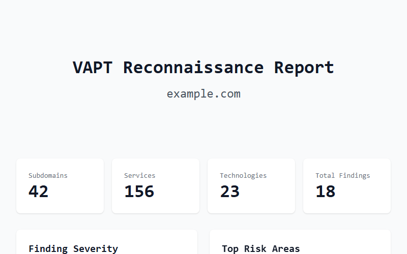
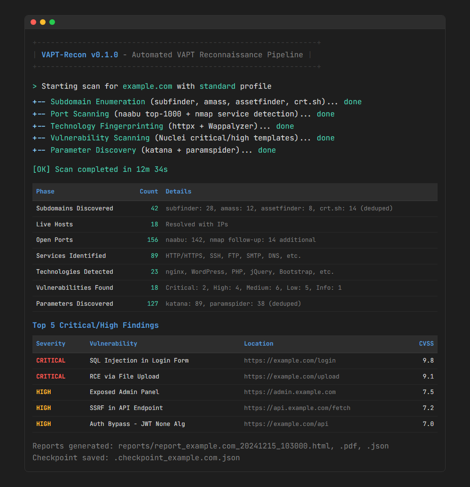
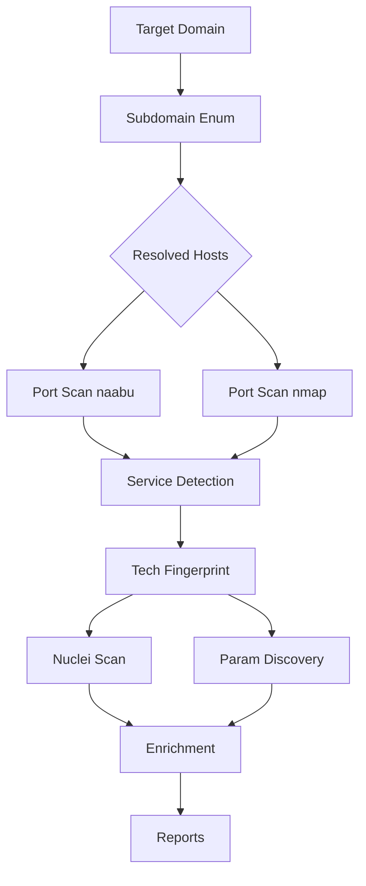

# VAPT-Recon

[](https://python.org)
[](LICENSE)
[](https://github.com/KingAtomic7/vapt-recon/pkgs/container/vapt-recon)
[](https://github.com/KingAtomic7/vapt-recon/actions/workflows/ci.yml)

> **Automated VAPT reconnaissance & vulnerability scanning pipeline.** Reduces manual recon from hours → minutes with professional HTML/PDF reports.

## Features

- 🎯 **Multi-source subdomain enumeration** — subfinder, amass, assetfinder, crt.sh with deduplication
- 🔍 **Port & service detection** — naabu for speed, nmap for service versioning
- 🧠 **Technology fingerprinting** — httpx + Wappalyzer for stack identification
- ⚡ **Vulnerability scanning** — Nuclei with profile-based template selection (CVE, exposures, misconfigs, injection)
- 📊 **Professional reports** — HTML (interactive + Chart.js), PDF (print-ready), JSON (CI/CD)
- ⚙️ **Scan profiles** — `quick` (5 min), `standard` (20 min), `deep` (60+ min), `compliance`
- 🔄 **CI/CD ready** — GitHub Actions for scheduled scans, automated releases, security scanning
- 🐳 **Docker support** — Multi-arch image with all Go tools pre-installed
- ⏸️ **Resume capability** — Checkpoint-based resume on interruption
- 🚦 **Rate limiting** — Token bucket for API/tool courtesy

## Quick Start

### Docker (Recommended for Scanning)
All Go tools pre-installed, multi-arch (amd64/arm64):
```bash
docker run -it --rm \
  -v $(pwd)/reports:/home/scanner/reports \
  ghcr.io/KingAtomic7/vapt-recon:latest \
  scan example.com --profile standard --report html,pdf
```

### pipx (Isolated — requires Go tools for scanning)
```bash
pipx install git+https://github.com/KingAtomic7/vapt-recon.git
# Install Go tools (see below), then:
vapt-recon scan example.com --profile standard
```

### Development Install (requires Go tools for scanning)
```bash
git clone https://github.com/KingAtomic7/vapt-recon.git
cd vapt-recon
pip install -e .[dev]

# Install Go 1.22+ and ProjectDiscovery tools:
go install -v github.com/projectdiscovery/subfinder/v2/cmd/subfinder@latest
go install -v github.com/projectdiscovery/naabu/v2/cmd/naabu@latest
go install -v github.com/projectdiscovery/nuclei/v3/cmd/nuclei@latest
go install -v github.com/projectdiscovery/httpx/cmd/httpx@latest
go install -v github.com/projectdiscovery/katana/cmd/katana@latest
go install -v github.com/projectdiscovery/dnsx/cmd/dnsx@latest
# Add ~/go/bin to PATH
```

## Usage

```bash
# Quick scan (5 min)
vapt-recon scan example.com --profile quick --report html

# Standard VAPT scan (20 min)
vapt-recon scan example.com --profile standard --report html,pdf,json

# Deep scan (60+ min)
vapt-recon scan example.com --profile deep --report html,pdf

# Compliance scan (PCI/DSS, HIPAA, etc.)
vapt-recon scan example.com --profile compliance --report html,pdf,json

# Resume interrupted scan
vapt-recon scan example.com --profile standard --resume

# Custom output directory
vapt-recon scan example.com -o ./my-reports --rate 50
```

## Scan Profiles

| Profile | Subdomains | Ports | Nuclei | Parameters | Enrichment | Est. Time |
|---------|-----------|-------|--------|-----------|------------|-----------|
| **quick** | subfinder | top 100 | critical only | ✗ | ✗ | ~5 min |
| **standard** | 4 sources | top 1000 + nmap | critical + high | katana, paramspider | WHOIS, DNS, SSL | ~20 min |
| **deep** | 6 sources + bruteforce | all ports + nmap scripts | all except dos/fuzz | + arjun, fuzzing | + Shodan, Censys | ~60 min |
| **compliance** | 3 sources | top 1000 + SSL scripts | compliance tags | katana, paramspider | WHOIS, DNS, SSL | ~30 min |

## Report Samples

| Format | Description |
|--------|-------------|
| **HTML** | Interactive, responsive, Chart.js severity chart, printable |
| **PDF** | Print-ready with TOC, page numbers, headers/footers |
| **JSON** | Structured for CI/CD, schema versioned |

### HTML Report Preview



*Full report: [docs/report-html.html](docs/report-html.html) | Full screenshot: [docs/report-html.png](docs/report-html.png)*

### Terminal Demo



## Architecture



## Configuration

### Profiles (`config/profiles.yaml`)
```yaml
profiles:
  standard:
    subdomains:
      sources: [subfinder, amass, assetfinder, crtsh]
      recursive: true
    ports:
      top_ports: 1000
      nmap_followup: true
    vulns:
      nuclei:
        severity: [critical, high]
        rate_limit: 100
```

### Environment Variables
```bash
export SHODAN_API_KEY="your-key"
export CENSYS_API_ID="your-id"
export CENSYS_API_SECRET="your-secret"
```

## CI/CD Integration

### GitHub Actions (Scheduled Scans)
```yaml
# .github/workflows/scheduled-scan.yml
on:
  schedule:
    - cron: '0 2 * * 1'  # Weekly Monday 2 AM
```

### GitLab CI
```yaml
vapt_scan:
  image: ghcr.io/KingAtomic7/vapt-recon:latest
  script:
    - vapt-recon scan $TARGET --profile standard --report json
  artifacts:
    reports:
      sast: reports/report_*.json
```

## Project Structure

```
vapt-recon/
├── cli.py                    # Typer CLI entry
├── pyproject.toml            # Modern Python packaging
├── Dockerfile                # Multi-stage build
├── Makefile                  # Dev convenience
├── generate_screenshots.py   # HTML report screenshot generator
├── generate_terminal_demo.py # Terminal demo screenshot generator
├── .pre-commit-config.yaml   # Pre-commit hooks
├── .dockerignore             # Docker ignore rules
├── .github/
│   └── workflows/
│       ├── ci.yml            # Main CI pipeline
│       ├── scheduled-scan.yml # Weekly scheduled scans
│       └── release.yml       # Automated releases
├── asciinema/
│   └── demo.cast             # Terminal demo recording
├── config/
│   ├── __init__.py
│   ├── profiles.yaml         # Scan profiles
│   ├── profiles.py           # Profile loader
│   └── nuclei-templates/     # Curated Nuclei templates
├── core/
│   ├── __init__.py
│   ├── models.py             # Pydantic models
│   ├── recon.py              # Main orchestrator
│   ├── subdomains.py         # Subdomain enumeration
│   ├── ports.py              # Port & service scanning
│   ├── tech.py               # Technology fingerprinting
│   ├── vulns.py              # Nuclei vulnerability scanning
│   └── params.py             # Parameter discovery & fuzzing
├── reporting/
│   ├── __init__.py           # Reporting facade
│   ├── template.html.j2      # HTML report template
│   ├── html.py               # HTML generator
│   ├── pdf.py                # PDF generator (WeasyPrint)
│   └── json.py               # JSON generator
├── utils/
│   ├── __init__.py
│   ├── rate_limit.py         # Token bucket rate limiter
│   ├── dedupe.py             # Cross-module deduplication
│   └── enrich.py             # WHOIS, DNS, SSL, Shodan, Censys
├── tests/
│   ├── conftest.py           # Pytest fixtures
│   └── test_integration.py   # Integration tests
└── docs/
    ├── architecture.md       # Architecture docs
    ├── configuration.md      # Configuration guide
    ├── report-html.html      # Sample HTML report
    ├── report-html-preview.png # HTML report preview
    ├── report-html.png       # Full HTML report screenshot
    └── terminal-demo.png     # Terminal demo screenshot
```

## Requirements

### System Dependencies (Docker handles these)
- **Go 1.22+** — for ProjectDiscovery tools
- **Nmap** — service version detection
- **Whois** — domain registration info
- **Python 3.11+**

### Python Dependencies
- `typer`, `rich` — CLI & TUI
- `pydantic` — Data validation
- `jinja2`, `weasyprint` — HTML/PDF reports
- `httpx`, `asyncio-throttle` — Async HTTP & rate limiting
- `pyyaml` — Config parsing

## Contributing

1. Fork & clone
2. Create feature branch: `git checkout -b feature/amazing-feature`
3. Make changes with tests
4. Run checks: `make lint typecheck test`
5. Commit with conventional commits: `feat: add amazing feature`
6. Push & open PR

## License

MIT License — see [LICENSE](LICENSE) for details.

## Acknowledgments

- [ProjectDiscovery](https://github.com/projectdiscovery) — subfinder, naabu, nuclei, httpx, katana
- [OWASP Amass](https://github.com/owasp-amass/amass) — Subdomain enumeration
- [Nuclei Templates](https://github.com/projectdiscovery/nuclei-templates) — Vulnerability templates
- [Wappalyzer](https://github.com/wappalyzer) — Technology detection

---

**Built for VAPT professionals by a VAPT practitioner.** ⚔️
